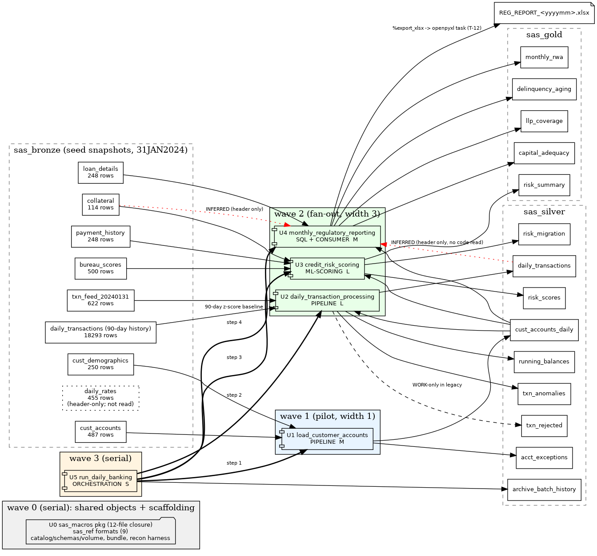

# P1 banking-core — Pipeline Analysis

Pipeline chosen at STOP B (DEC-012, 2026-09-01). Analysis only: no decisions, no code, no child sessions. Every claim carries a `file:line` cite; every type or lineage edge is **FACT** (explicit in executable code) or **INFERRED** (carried through, header comment, or sequence-only).

Inputs: `docs/migration/ts-sas-legacy-analytics_estate_inventory.md` (shared-object map, coverage), `docs/migration/ts-sas-legacy-analytics_target_state.md` (CORE, SQL, PIPELINE, ORCHESTRATION, CONSUMER, ML-SCORING, DATA/DEPENDENCY — all present for this pipeline's workload types), `.migration/03_recon_tolerances.md` v1. Mechanical column extraction: `.migration/tools/p1_columns.{py,json,md}`.

---

## 1. Pinned scope

| | Value | Cite |
|---|---|---|
| Entry feeds | `ORA_DW.CUST_ACCOUNTS`, `ORA_DW.CUST_DEMOGRAPHICS`, `ORA_DW.BUREAU_SCORES`, `ORA_DW.PAYMENT_HISTORY`, `ORA_DW.COLLATERAL`, `ORA_DW.LOAN_DETAILS`, `RAW_BANK.TXN_FEED_<yyyymmdd>`, pre-existing `CURATED.DAILY_TRANSACTIONS` history (90-day z-score baseline) | `load_customer_accounts.sas:59-60`, `credit_risk_scoring.sas:73-81`, `monthly_regulatory_reporting.sas:60-61,91-92,134-135`, `daily_transaction_processing.sas:37,166-167` |
| Units | `run_daily_banking` + `load_customer_accounts`, `daily_transaction_processing`, `credit_risk_scoring`, `monthly_regulatory_reporting` | `BatchJobs/run_daily_banking.sas:121-130` |
| Terminal outputs | silver: `cust_accounts_daily`, `acct_exceptions`, `daily_transactions`, `running_balances`, `txn_anomalies`, `txn_rejected` (new, was WORK-only), `risk_scores`, `risk_migration`, `archive_batch_history`; gold: `risk_summary`, `monthly_rwa`, `delinquency_aging`, `llp_coverage`, `capital_adequacy`; consumer: `REG_REPORT_<yyyymm>.xlsx` (T-12, not reconciled) | §3 |
| Exclusions | P2 `customer_profitability` (consumer of `risk_scores`, `cust_accounts_daily`, `daily_transactions`; deferred), P3 insurance (D10-003), 80 unreachable macros + `Parent-Child-Index.sas` (PROPOSED-unused), `RAW_BANK.DAILY_RATES` (declared in header `load_customer_accounts.sas:7`, **never read by code** — INFERRED absent) | inventory §3-4 |
| Business date | Recon: `31JAN2024`, `PREV_YM=202401` per `Config/autoexec_local.sas:74,76`. **Risk**: production `autoexec.sas:89-91` sets `PREV_YM` = previous calendar month, so the daily orchestrator runs `monthly_regulatory_reporting` for month-end `SNAPSHOT_DATE` rows that `load_customer_accounts` (writes only `SNAPSHOT_DATE = run_date`) produced a month earlier. The target reproduces this exactly (`report_month` job parameter, default `202401` for recon); it is not "fixed". | `monthly_regulatory_reporting.sas:22-28,63` |

Nothing unreachable was found inside the boundary; nothing outside it is pulled in.

## 2. Unit inventory

| Unit | Source | Workload | Reads | Writes | Complexity | Shared? | Dialect risk flags | Size |
|---|---|---|---|---|---|---|---|---|
| U1 `load_customer_accounts` | `Programs/Banking/load_customer_accounts.sas` (216 lines, 1 PROC SQL, 2 DATA steps, 1 PROC SQL insert) | PIPELINE | `ORA_DW.CUST_ACCOUNTS`, `ORA_DW.CUST_DEMOGRAPHICS` | `STG_BANK.CUST_ACCOUNTS_DAILY` (full replace for the run), `STG_BANK.ACCT_EXCEPTIONS` (insert) | 3 derived numerics, 2 flags, multi-output DATA step with early `output` (lines 129/138/146) | no | `intck('month')` boundary semantics (line 100); `region` macro branch (`%if &region ne ALL`, line 64) → job parameter; multi-output PDV means exception rows carry pre-assignment values (see `p1_columns.md` note) | M |
| U2 `daily_transaction_processing` | `Programs/Banking/daily_transaction_processing.sas` (246 lines) | PIPELINE | `RAW_BANK.TXN_FEED_<yyyymmdd>` (dataset name from `putn(txn_date, yymmddn8.)`, line 25), `STG_BANK.CUST_ACCOUNTS_DAILY`, `CURATED.DAILY_TRANSACTIONS` (90-day self-history, line 166-167) | `CURATED.DAILY_TRANSACTIONS` (`PROC APPEND` under `%lock`, 205-211), `CURATED.TXN_ANOMALIES` (append, 214), `CURATED.RUNNING_BALANCES` (222-224), `WORK.TXN_REJECTED` (rejects, 45-50; discarded in legacy) | Validation two-target DATA step; **row-sequential** `retain RUNNING_BALANCE` / `by ACCOUNT_ID TRANSACTION_DATE TRANSACTION_ID` / `first.` (139-143); `mean`/`std` z-score (163-164, 182) | no | RETAIN → window `SUM() OVER (PARTITION BY account ORDER BY date, id ROWS UNBOUNDED PRECEDING)`; `std` is SAS sample std (n-1) → Spark `stddev_samp`; reads its own output table (append idempotency: MERGE on `TRANSACTION_ID`); z-score divide-by-zero when `STD_TXN_AMT=0` (SAS yields missing + note) | L |
| U3 `credit_risk_scoring` | `Programs/Banking/credit_risk_scoring.sas` (270 lines) | ML-SCORING | `STG_BANK.CUST_ACCOUNTS_DAILY`, `ORA_DW.BUREAU_SCORES` (latest `SCORE_DATE ≤ score_date` correlated subquery, 76-77), `ORA_DW.PAYMENT_HISTORY`, `ORA_DW.COLLATERAL` | `CURATED.RISK_SCORES` (append, `%lock`, 229-234), `CURATED.RISK_MIGRATION` (append, 236-241), `REPORTS.RISK_SUMMARY` (PROC MEANS, 247-254) | Fixed scorecard `CRM-2023-Q4-v2`: 5 WoE binnings + intercept (92-150), `PD=1/(1+exp(-LOG_ODDS))` (157), LGD/EAD rules (163,173), EL (179), 7 rating bands (183-190) | no | `exp()` last-ulp (ML-2 tolerance); `max/min` with missing LTV (SAS `max(0, .)`=0 vs Spark `greatest(0, NULL)`=NULL — **named risk**); correlated subquery over bureau history; `MODEL_ID` length undeclared (`char$UNKNOWN`) | L |
| U4 `monthly_regulatory_reporting` | `Programs/Banking/monthly_regulatory_reporting.sas` (199 lines) | SQL + CONSUMER | `STG_BANK.CUST_ACCOUNTS_DAILY` @ `month_end`, `ORA_DW.LOAN_DETAILS`. Header declares `CURATED.DAILY_TRANSACTIONS`, `ORA_DW.COLLATERAL` (lines 9-10) — **not read by code** (INFERRED edges) | `REPORTS.MONTHLY_RWA`, `DELINQUENCY_AGING`, `LLP_COVERAGE`, `CAPITAL_ADEQUACY` (create-table, 41/73/115/170); `%export_xlsx` ×4 into one workbook (146-165) | 4 PROC SQL aggregates, `calculated` reuse (59, 133), hard-coded capital constants (175-177, "placeholder … from GL in production") | no | `sum()/sum()*100` with zero denominators (`NPL_COVERAGE_PCT`, 133) → SAS missing vs Spark NULL (same after `NULL` handling; assert explicitly); `calculated` → CTE; xlsx out of gate (T-12) | M |
| U5 `run_daily_banking` | `BatchJobs/run_daily_banking.sas` (161 lines) | ORCHESTRATION | step return codes | `ARCHIVE.BATCH_HISTORY` (`PROC APPEND`, 142) | `%run_step` ×4 with `restart_from`, `ABORT_ON_ERR` (100-110), `%sendmail` on failure/summary (106, 146) | **shared write target** with `run_daily_insurance.sas` (D9-INV-001) | job-level restart → task retry; email → job notifications (no SMTP in demo) | S |
| U0 shared (estate property, wave 0) | 12-file macro closure (`parmv nobs lock sendmail export_xlsx export_dbms handle get_data_attr loop seplist useridToEmail queryActiveDirectory`), `Formats/banking_formats.sas` (9 `value`), `Config/autoexec*.sas` | D2 | — | `sas_ref.*` format tables, Python package, job parameters | inventory §3 | yes — inherited by P2, P3 | `lock` → no-op under Delta ACID; `sendmail` → notification stub; `export_xlsx`/`export_dbms` (621 lines) → openpyxl task — only the *behaviour used* by P1 programs is ported | M |

Macro call profile inside P1 (FACT, grep): `%sysfunc` 22, `%nobs` 8, `%parmv` 6, `%lock` 6, `%run_step` 4, `%sendmail` 3, `%export_xlsx` 3.

## 3. Field/type dictionary

Full per-column extraction (169 columns, 14 tables, with cites and FACT/INFERRED marks) is in `.migration/tools/p1_columns.md`. Mapping rules (target-state SQL/PIPELINE profiles, lower_snake names):

| SAS evidence | Delta type | Mark | Rule |
|---|---|---|---|
| Seed CSV id/code columns (`ACCOUNT_ID`, `CUSTOMER_ID`, `ACCOUNT_TYPE`, `CHANNEL`, `REGION_CODE`, …) | `STRING` | INFERRED (no `length` in code; CSV samples `A00000001`, `CC`) | compared after `rtrim` (T-3) |
| Seed CSV dates (`OPEN_DATE=27NOV2011`, `TRANSACTION_DATE`, `SCORE_DATE`, `LAST_APPRAISAL_DATE`) | `DATE` | INFERRED (DATE9. samples) | bronze loader parses `ddMONyyyy` |
| Money / balances (`*_BALANCE`, `*_AMOUNT`, `CREDIT_LIMIT`, `EAD`, `EXPECTED_LOSS`, `RWA`, `TOTAL_*`, `GROSS_LOANS`, `NPL_BALANCE`, `CET1_CAPITAL`…) | `DECIMAL(18,2)` where the legacy carries `DOLLAR18.2`/`DOLLAR20.2`; computed money kept `DOUBLE` and compared at T-4 | FACT (format) / INFERRED (seed) | T-4 abs ≤ 0.005 |
| Ratios/percentages (`UTILIZATION_PCT`, `LTV`, `COVERAGE_PCT`, `*_RATIO`, `INTEREST_RATE`, `BUREAU_UTIL_PCT`, `AVG_PMT_RATIO_12MO`) | `DOUBLE` | FACT (`8.4`, `8.2`) / INFERRED | T-5 abs ≤ 1e-6 |
| Scorer (`PD`, `LGD`) | `DOUBLE` | FACT (`PERCENT8.4` is display only) | ML-2/3 |
| Counts / integer-like (`N_ACCOUNTS`, `N_LOANS`, `ACCT_AGE_MONTHS`, `DAYS_INACTIVE`, `NEW_RISK_RATING`, `RISK_RATING`, `RISK_WEIGHT`, `STEP_NUM`, bureau counts) | `INT` (`RISK_WEIGHT` `DOUBLE`) | FACT / INFERRED | T-3 exact |
| Statistics (`AVG_TXN_AMT`, `STD_TXN_AMT`, `Z_SCORE`, `AVG_PD`, `AVG_LGD`) | `DOUBLE` | FACT | T-6; `std` = `stddev_samp` |
| Flags/labels (`DORMANCY_FLAG` `$1`, `ANOMALY_TYPE` `$20`, `MIGRATION_DIRECTION` `$10`, `DELINQ_BUCKET` `$10`, `*_STATUS` `$4`, `REPORT_MONTH` `$6`, `REJECT_REASON` `$200`, `BATCH_HISTORY` chars) | `STRING` | FACT (`length`/literal) | T-3 exact after `rtrim` |
| Run timestamps (`LOAD_TIMESTAMP`, `SCORE_TIMESTAMP`, `START_TIME`, `END_TIME`) | `TIMESTAMP` | FACT (`datetime()`) | excluded (T-7), non-null asserted |
| `DURATION` (`TIME8.` seconds) | `DOUBLE` seconds | FACT | excluded (run-time derived) |
| `MODEL_ID` | `STRING` | FACT value `CRM-2023-Q4-v2`, length UNKNOWN | exact |
| `SNAPSHOT_DATE` / `SCORE_DATE` (`"&date"d`) | `DATE` = `business_date` job parameter | FACT | key column |

INFERRED rows (all bronze-carried columns) are where parity breaks first: CSV → Delta type coercion (numeric vs string ids, blank `CLOSE_DATE` → NULL) is asserted by the bronze loader's schema in wave 0 and by T-2/T-3 in every downstream unit.

## 4. Dependency table (register mode; decisions belong to the plan/STOP C)

Entries appended to `.migration/04_dependency_register.md` (P1-touching subset; full register there).

| ID | Class | Crossing | Contract (direction / format / frequency / owner) | Status | Lead-time exposure |
|---|---|---|---|---|---|
| D2-001/002/003, D2-INV-001 | D2 | 12-macro closure, 9 banking formats, autoexec librefs + globals | estate → wave 0; inherited by P2/P3 | UNDECIDED (closure-only vs all 92) | none |
| D3-001..006, 008, 009 | D3 | Oracle DW + raw feed inputs | inbound; seeded CSV today; live source unreachable (D10-002); owner customer | RESOLVED for recon (seeded); cutover ingestion contract UNDECIDED | **high** — no Oracle/Teradata path exists; blocks STOP E, not conversion |
| D3-INV-001 | D3 | header-only inputs `CURATED.DAILY_TRANSACTIONS`, `ORA_DW.COLLATERAL` in U4 | documentation-only edges; no code read (`monthly_regulatory_reporting.sas:60-61,91-92,134-135`) | UNDECIDED — governs wave-2 width (see §5) | none |
| D4-001 | D4 | `REPORTS.*` gold tables | outbound; Delta tables are the contract; consumers unknown beyond xlsx | UNDECIDED | low |
| D4-002 | D4 | `REG_REPORT_<yyyymm>.xlsx` (4 sheets) | outbound file to `&REPORT_PATH`; regulators; monthly | UNDECIDED (rebuild via openpyxl per CONSUMER profile) | low |
| D4-003 | D4 | `%sendmail` to `EMAIL_DL`/`EMAIL_ONCALL` | outbound; failure + summary; no SMTP in demo | UNDECIDED | low |
| D5-001/002, D10-005 | D5 | Control-M trigger; step order 1→4 | inbound trigger; daily; no export in repo | UNDECIDED | **medium** — trigger wiring unverifiable until export |
| D9-002 | D9 | `RISK_RATING` consumed by U2 (line 124) and U3 `PREV_RATING` (207) comes from `CUST_ACCOUNTS_DAILY` (demographics), not from the scorer | intra-P1, wave order handles it | UNDECIDED (trivial) | none |
| D9-001, D6-INV-001 | D9/D6 | P2 `customer_profitability` reads `RISK_SCORES`; trigger unknown | not touched by any P1 wave | out of P1 scope → P2 plan | none for P1 |
| D9-INV-001 | D6 (shared table) | `ARCHIVE.BATCH_HISTORY` written by both orchestrators (`run_daily_banking.sas:142`, `run_daily_insurance.sas`) | append-only, 9 columns; insurance writer not migrating in P1 | UNDECIDED | none (insurance not running on target) |
| D10-001 | D10 | no SAS runtime | recon = option (b) reference-derived (DEC-004) | OPEN; scope constraint | gates STOP E (customer in-perimeter recon) |
| D10-002 | D10 | no Oracle/Teradata | see D3 | OPEN | high (STOP E) |
| D10-006 | D10 | catalog `sas_legacy` unprovisioned | Devin creates in wave 0 | OPEN → wave 0 | none |
| D10-007 | D10 | legacy output baseline absent | option (b): independent session builds Python reference from SAS source | OPEN → wave 0 workstream | none |
| D7-INV-001, D10-INV-001 | D7/D10 | no last-run evidence for units 3-7; estate completeness UNVERIFIABLE | informational | UNDECIDED (accept as constraint) | none |
| D10-003/004 | D10 | insurance seed, `COST_OF_FUNDS` | P3/P2 only | not touched by P1 | none |

No P1 entry has an unresolved *contract* field; the unresolved items are decisions, which is what STOP C is for.

## 5. Waves and fan-out batches

Lineage depth (FACT edges): U1 → {U2, U3, U4} → U5. Rendered DAG: `docs/migration/ts-sas-legacy-analytics_P1_banking_core_dag.png` (source `.migration/tools/p1_dag.dot`).

| Wave | Batches (one child each) | Write targets (all `sas_legacy.`) | Width | Notes |
|---|---|---|---|---|
| 0 | W0-A scaffolding: catalog + 5 schemas + volume `sas_bronze.landing`, bronze load of 9 seed CSVs, `sas_ref` 9 format tables, `sas_macros` package, bundle skeleton, recon harness, `sas_recon.run_log`. **W0-R** (independent recon session, not a migrating child): Python reference implementation per DEC-004, reference outputs committed under `docs/migration/recon/reference/` with manifest and the caveat "reference-derived, not SAS-produced" | `sas_bronze.*`, `sas_ref.*`, `sas_recon.run_log` | serial (W0-A then W0-R may run concurrently — disjoint: W0-R writes only repo files) | shared objects are estate property |
| 1 (pilot) | B1 = U1 | `sas_silver.cust_accounts_daily`, `sas_silver.acct_exceptions` | 1 (≤5) | first PIPELINE unit: calibrates dialect skill, bronze typing, harness |
| 2 | B2 = U2; B3 = U3; B4 = U4 | B2: `daily_transactions`, `running_balances`, `txn_anomalies`, `txn_rejected`; B3: `risk_scores`, `risk_migration`, `sas_gold.risk_summary`; B4: `sas_gold.monthly_rwa`, `delinquency_aging`, `llp_coverage`, `capital_adequacy` | **3** if D3-INV-001 is decided "header-only edges are not lineage"; **2** otherwise (B2+B4 merged into one child, since the INFERRED edge U2→U4 must be treated as FACT) | each batch is the first of its pattern class (PIPELINE-sequential, ML-SCORING, SQL-report), so the per-class calibration rule is satisfied automatically |
| 3 | B5 = U5 | `sas_silver.archive_batch_history`, job `sas_legacy_run_daily_banking` (tasks 1→4, schedule PAUSED) | 1 | end-to-end run over B1-B4 deployables |

Serial floor: 4 waves (0-3). Max useful width: 3. D10 concurrency: serverless warehouse `565cd2fd713738c4` + serverless jobs; width 3 is far below any limit. No two same-wave batches share a write target (checked against §3). Legacy-query concurrency cap: N/A (no live legacy).

## 6. Recon plan per unit (DEGRADED mode, tolerances v1, size tier: all tables < 5M rows → full row-level diff)

Dual-run source for every unit: reference outputs from W0-R (`docs/migration/recon/reference/<table>.csv`) computed from `Data/csv` @ manifest in `05_progress.md`; target side read from `sas_legacy.<schema>.<table>` on the serverless warehouse. Legacy-side query cost: 0 (local reference).

| Unit | Table (target) | Keys (T-2) | Checks | Population / declared source volume | Determinism rule |
|---|---|---|---|---|---|
| U1 | `cust_accounts_daily` | `account_id, snapshot_date` | T-1 count; T-2 keys; T-3 all codes/dates/flags; T-4 balances; T-5 `utilization_pct`; T-7 `load_timestamp`; T-8 aggregates | accounts with `status ∉ {W,C}` and `open_date ≤ business_date` from 487 source rows | none needed (set semantics) |
| U1 | `acct_exceptions` | `account_id, exception_type` | T-1, T-2, T-9 per `EXCEPTION_TYPE`, T-3 | exception rows only | PDV early-output values reproduced as-is |
| U2 | `daily_transactions` | `transaction_id` | T-1..T-4, T-8; `running_balance` T-4 | 622 feed rows minus rejects, appended to 18,293 history rows (idempotency: second run adds 0 rows) | compare as set on key (T-10) |
| U2 | `running_balances` | `account_id, transaction_date, transaction_id` | T-1, T-2, T-4 | same feed population | ordering by `(ACCOUNT_ID, TRANSACTION_DATE, TRANSACTION_ID)`; ties impossible (unique `TRANSACTION_ID`) |
| U2 | `txn_anomalies` | `transaction_id` | T-1, T-2, T-6 (`z_score`, `avg`, `std`), T-3 `anomaly_type` exact | feed rows with z-score above threshold; `std=0` → no anomaly (SAS missing) — asserted explicitly | `stddev_samp` |
| U2 | `txn_rejected` | `transaction_id` | T-9 per `reject_reason` | rejects only | — |
| U3 | `risk_scores` | `account_id, score_date` | ML-1..ML-5, ML-7 edge list, T-2, T-7 `score_timestamp`; T-3 on carried bureau columns; ML-8 `woe_*` debug table on any failure | scored accounts (types MTG/AUTO/PERS/CC/LOC/HELC) from `cust_accounts_daily` | `greatest/least` NULL handling for missing LTV stated in the unit hand-off |
| U3 | `risk_migration` | `account_id, score_date` | ML-6 exact, T-1 | accounts whose rating changed | — |
| U3 | `risk_summary` (gold) | `account_type, new_risk_rating` | T-1, T-3 counts, T-5 `avg_pd/avg_lgd`, T-4 `total_ead/total_el` | all groups | — |
| U4 | `monthly_rwa` | `report_month, account_type, customer_segment` | T-1, T-2, T-3 `n_accounts`, T-4 `total_exposure/rwa` | `snapshot_date = month_end (31JAN2024)` | — |
| U4 | `delinquency_aging` | `report_month, account_type, region_code, delinq_bucket` | T-1..T-4 | same | — |
| U4 | `llp_coverage` | `report_month, account_type` | T-1..T-5 (`coverage_pct`, `npl_coverage_pct`; zero-denominator → NULL asserted) | loan types only | — |
| U4 | `capital_adequacy` | `report_month` | T-1, T-4, T-5, T-3 `*_status` | 1 row | — |
| U4 | xlsx | — | not reconciled (T-12); file exists with 4 sheets | — | — |
| U5 | `archive_batch_history` | `batch_id, step_num` | T-1 = 4 rows per run; T-3 `status`, `step_name`; T-7 times excluded | one orchestrated run | — |

## 7. Risk list

1. **INFERRED bronze types** (all carried columns): mis-typed ids or dates surface as T-2/T-3 failures in U1 first — the pilot is deliberately U1.
2. **`max/min` with missing** in U3 (`LGD = max(0, min(1, (LTV-0.5)*0.8))`, `credit_risk_scoring.sas:163`): SAS ignores missing arguments; Spark `greatest`/`least` return NULL. Must be `coalesce`d per the reference; ML-3 catches it.
3. **Sample std** (`std()` → `stddev_samp`) and **z-score with zero std** in U2; T-6 catches it.
4. **`intck('month')`** counts month boundaries, not elapsed months — Spark `months_between` differs; use boundary-count semantics (`(year*12+month)` difference). U1, `ACCT_AGE_MONTHS`.
5. **`PREV_YM` semantics** (§1): recon default `202401` matches the local autoexec, not production's previous-month rule; documented, parameterised, not corrected.
6. **Append idempotency**: U2/U3 legacy `PROC APPEND` under `%lock` re-appends on re-run; target uses MERGE on business key — behavior intentionally differs (recorded in PIPELINE profile), recon runs from a clean isolated area every time.
7. **Hard-coded capital constants** in U4 (`50000000/65000000/80000000`) are reproduced verbatim; flagged for the customer as a placeholder, not corrected.
8. **Scale**: seed parity (487 accounts / 622 txns) does not extrapolate to `Logs/` production volumes (847k / 2.3M); STOP E entry criterion stays the customer's in-perimeter recon (03_recon_tolerances.md).
9. **Unverifiable trigger** (Control-M): job ships with schedule PAUSED; trigger wiring is a STOP E item.
10. **Reference-derived baseline** (DEC-004): both sides can share a misreading of the SAS; every report carries the caveat.

## Validation against playbook spec

(1) all 5 units + shared closure inventoried; (2) wave order U0→U1→{U2,U3,U4}→U5 is a valid topological sort of FACT edges; (3) no same-wave write-target overlap (§5); (4) cites throughout; (5) every crossing in §4 has a contract or an explicit decision flag; (6) every unit has recon rows in §6.
