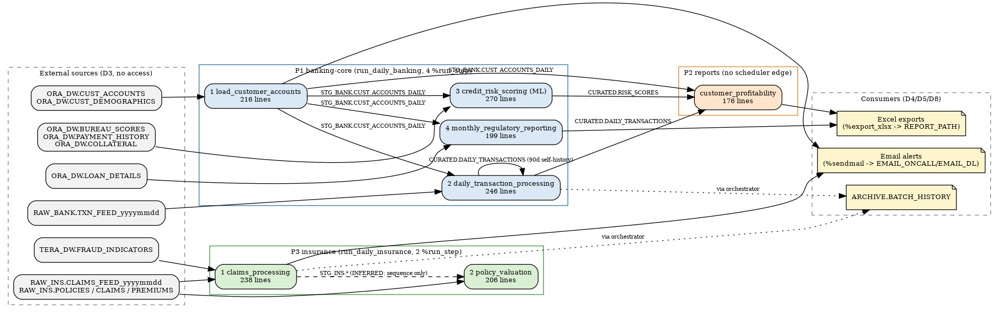

# Estate Inventory — ts-sas-legacy-analytics (Base SAS 9.4 → Databricks)

**Repo:** `Cognition-Partner-Workshops/ts-sas-legacy-analytics` · **Branch:** `migration/00-setup` · **Census date:** 2026-09-01
**Method:** mechanical file census (`.migration/tools/census.py`, stdlib only, read-only over the repo; raw output `.migration/tools/census.json` / `census_summary.md`). Legacy dirs untouched.
**Status:** ready for **STOP B** (user picks the first pipeline; this document recommends, it does not choose).

---

## 1. Census (what exists)

| Directory | Files | SAS files | Role |
|---|---:|---:|---|
| `Programs/Banking` | 4 | 4 | production programs (3 data, 1 model) |
| `Programs/Insurance` | 2 | 2 | production programs |
| `Programs/Reports` | 1 | 1 | production program |
| `Programs/Parent-Child-Index.sas` | 1 | 1 | standalone demo program, not scheduled |
| `BatchJobs` | 2 | 2 | orchestrators (`%run_step` loops) |
| `Config` | 2 | 2 | `autoexec.sas` (PROD), `autoexec_local.sas` (local harness) |
| `Formats` | 2 | 2 | 14 `value` statements (9 banking, 5 insurance) |
| `Macro` | 93 | 92 | utility macro library (91 primary `%macro` definitions; `RunAll_ControlTable.sas` defines none; `handle_email.txt` is a text support file) |
| `Data` | 16 | 3 | recon baseline CSVs (9) + local bootstrap harness (7) |
| `Logs` | 2 | 0 | run evidence 2024-01-15 for `load_customer_accounts`, `daily_transaction_processing` |
| `AMO`, `EGProjects`, `Presentations` | 16 | 0 | Office/EG binaries, no code lineage |
| `README.md`, `UNLICENSE.txt`, `.gitignore` | 3 | 0 | repo metadata |
| **Total (excl. `.git/`, `docs/`, `.migration/`)** | **144** | **109** | |

**Intake-count corrections (FACT, from source):**
- "92 macros": `Macro/` holds 93 files = 92 `.sas` + `handle_email.txt`; 91 primary macro definitions (128 `%macro` statements incl. nested helpers such as `lock_base`/`lock_spde` inside `lock.sas`).
- Formats: 9 banking + 5 insurance `value` statements (`banking_formats.sas:15,31,44,56,71,82,94,106,117`; `insurance_formats.sas:14,32,49,59,73`). Any prior "10 + 6" figure is not supported by the source.

### 1.1 Object register (production code)

| # | Object | Type | Path | Lines | PROCs / DATA | Last-run evidence |
|---|---|---|---|---:|---|---|
| 1 | `load_customer_accounts` | data program | `Programs/Banking/load_customer_accounts.sas` | 216 | sql 2, datasets 1, means 1 / 1 | `Logs/load_customer_accounts_20240115.log` (FACT) |
| 2 | `daily_transaction_processing` | data program | `Programs/Banking/daily_transaction_processing.sas` | 246 | sql 3, append 2, datasets 1 / 3 | `Logs/daily_transaction_processing_20240115.log` (FACT) |
| 3 | `credit_risk_scoring` | **model program** (scorecard CRM-2023-Q4-v2, scoring only) | `Programs/Banking/credit_risk_scoring.sas` | 270 | append 2, sql 2, datasets 1, means 1 / 1 | none in repo |
| 4 | `monthly_regulatory_reporting` | data program | `Programs/Banking/monthly_regulatory_reporting.sas` | 199 | sql 4 / 0 | none in repo |
| 5 | `customer_profitability` | data program | `Programs/Reports/customer_profitability.sas` | 176 | sql 3, means 2, datasets 1 / 1 | none in repo; **no scheduler edge** (not in either orchestrator) |
| 6 | `claims_processing` | data program | `Programs/Insurance/claims_processing.sas` | 238 | append 3, datasets 1, sql 1 / 4 (hash objects) | none in repo |
| 7 | `policy_valuation` | data program | `Programs/Insurance/policy_valuation.sas` | 206 | sql 3, datasets 1, means 1 / 2 | none in repo |
| 8 | `run_daily_banking` | orchestrator | `BatchJobs/run_daily_banking.sas` | 161 | 4 `%run_step` → 1,2,3,4 in that order; writes `ARCHIVE.BATCH_HISTORY` | Control-M export absent (D10-005) |
| 9 | `run_daily_insurance` | orchestrator | `BatchJobs/run_daily_insurance.sas` | 133 | 2 `%run_step` → 6,7 | Control-M export absent (D10-005) |

Complexity signal = source lines + PROC/DATA-step counts (no runtime metrics available: no SAS runtime, no scheduler history — D10-001/005).

---

## 2. Lineage (mechanically extracted; each edge marked)

Legend: **FACT** = literal libref.table in executable code; **INFERRED** = header comment, sequence position, or macro-variable-resolved name.

### 2.1 Reads / writes per program

| Program | Reads | Writes |
|---|---|---|
| load_customer_accounts | `ORA_DW.CUST_ACCOUNTS`, `ORA_DW.CUST_DEMOGRAPHICS` (FACT); `STG_BANK.CUST_ACCOUNTS_DAILY` (FACT, prior-day self-read) | `STG_BANK.CUST_ACCOUNTS_DAILY`, `STG_BANK.ACCT_EXCEPTIONS` (FACT) |
| daily_transaction_processing | `RAW_BANK.TXN_FEED_&yyyymmdd` (FACT, name resolved from `run_date` → INFERRED member), `STG_BANK.CUST_ACCOUNTS_DAILY`, `CURATED.DAILY_TRANSACTIONS` (FACT, 90-day self-history) | `CURATED.DAILY_TRANSACTIONS`, `CURATED.RUNNING_BALANCES`, `CURATED.TXN_ANOMALIES` (FACT) |
| credit_risk_scoring | `STG_BANK.CUST_ACCOUNTS_DAILY`, `ORA_DW.BUREAU_SCORES`, `ORA_DW.PAYMENT_HISTORY`, `ORA_DW.COLLATERAL` (FACT) | `CURATED.RISK_SCORES`, `CURATED.RISK_MIGRATION`, `REPORTS.RISK_SUMMARY` (FACT) |
| monthly_regulatory_reporting | `STG_BANK.CUST_ACCOUNTS_DAILY`, `ORA_DW.LOAN_DETAILS` (FACT, lines 60-61, 91-92, 134-135); header also lists `CURATED.DAILY_TRANSACTIONS`, `ORA_DW.COLLATERAL` — **header-only, no code read (INFERRED, likely stale header)** | `REPORTS.MONTHLY_RWA`, `REPORTS.DELINQUENCY_AGING`, `REPORTS.LLP_COVERAGE`, `REPORTS.CAPITAL_ADEQUACY` (FACT); 3 `%export_xlsx` (FACT) |
| customer_profitability | `STG_BANK.CUST_ACCOUNTS_DAILY`, `CURATED.DAILY_TRANSACTIONS`, `CURATED.RISK_SCORES` (FACT); header lists `ORA_DW.COST_OF_FUNDS` — **header-only, no code read (INFERRED)** | `REPORTS.CUSTOMER_PNL`, `REPORTS.SEGMENT_PROFITABILITY`, `REPORTS.BRANCH_PROFITABILITY` (FACT); 1 `%export_xlsx` (FACT) |
| claims_processing | `RAW_INS.CLAIMS_FEED_&yyyymmdd` (INFERRED member), `RAW_INS.POLICIES` (FACT, hash load), `TERA_DW.FRAUD_INDICATORS` (FACT) | `STG_INS.CLAIMS_REGISTER`, `STG_INS.CLAIMS_REVIEW_QUEUE`, `STG_INS.FRAUD_ALERTS` (FACT, `proc append`) |
| policy_valuation | `RAW_INS.POLICIES`, `RAW_INS.CLAIMS`, `RAW_INS.PREMIUMS` (FACT); `STG_INS.POLICY_VALUATION` (FACT, self) | `STG_INS.POLICY_VALUATION`, `REPORTS.LOSS_RATIO_SUMMARY` (FACT) |
| run_daily_banking / run_daily_insurance | `%include` of each program (FACT) | `ARCHIVE.BATCH_HISTORY` (FACT) |

Note: `claims_processing` → `policy_valuation` has **no table edge** in code (policy_valuation reads only `RAW_INS.*`); the dependency is orchestration order only (INFERRED).

### 2.2 Scheduler edges
- `run_daily_banking`: `load_customer_accounts` → `daily_transaction_processing` → `credit_risk_scoring` → `monthly_regulatory_reporting` (FACT, `%run_step` lines). Monthly program runs inside a daily orchestrator; month-end gating is internal to the program (INFERRED from name; verify in analysis).
- `run_daily_insurance`: `claims_processing` → `policy_valuation` (FACT).
- `customer_profitability`: **no inbound scheduler edge anywhere in the repo** (FACT: absent from both orchestrators). Trigger is unknown (Control-M export missing, D10-005).
- Upstream trigger for both orchestrators: Control-M assumed (D6), unverified.

### 2.3 Consumer edges
- Excel: `%export_xlsx` × 4 (monthly_regulatory_reporting ×3, customer_profitability ×1) to `&REPORT_PATH` (FACT) — D5.
- Email: `%sendmail` from load_customer_accounts:175, claims_processing, both orchestrators, to `&EMAIL_ONCALL` / `&EMAIL_DL` (FACT; `autoexec.sas:95-96`) — D4/D8.
- Downstream table consumers of `REPORTS.*` / `CURATED.RISK_SCORES` outside this repo: **unknown** (no metadata source) — D8 remains open.

### 2.4 DAG

Source: `.migration/tools/estate_dag.dot`.

---

## 3. Shared-object map (wave 0 candidates)

Macro reachability was computed as the transitive closure of `%name(` calls starting from the 7 programs + 2 orchestrators (FACT, `census.json.macro_call_counts`):

| Shared object | File | Lines | Used by | Proposed owner |
|---|---|---|---|---|
| `parmv` | `Macro/parmv.sas` | 359 | all 7 programs | wave 0 |
| `nobs` | `Macro/nobs.sas` | 253 | 6 programs (not monthly_regulatory_reporting) | wave 0 |
| `lock` (+ `lock_base`, `lock_spde`) | `Macro/lock.sas` | 352 | daily_transaction_processing, credit_risk_scoring | wave 0 |
| `sendmail` | `Macro/sendmail.sas` | 260 | load_customer_accounts, claims_processing, both orchestrators | wave 0 (D4 decision governs target) |
| `export_xlsx` → `export_dbms` | `Macro/export_xlsx.sas`, `Macro/export_dbms.sas` | 101 + 520 | monthly_regulatory_reporting, customer_profitability | wave 0 (D5 decision governs target) |
| transitive helpers of the above: `handle`, `get_data_attr`, `loop`, `seplist`, `useridToEmail`, `queryActiveDirectory` | `Macro/*.sas` | 451, 226, 248, 200, 112, 480 | via `lock`/`sendmail` | wave 0 **only if** the owning macro's behaviour is ported rather than replaced (e.g. `lock` → Delta ACID makes it a no-op; `sendmail` → alerting service) |
| Formats: `$ACCTTYPE $ACCTSTAT RISKRATE $TXNCAT DELQBKT BALRANGE $REGION $CUSTSEG $LNPURP` | `Formats/banking_formats.sas` | 9 values | banking programs (fmtsearch) | wave 0 → `sas_ref` lookup tables |
| Formats: `$POLTYPE $CLMSTAT $RISKCAT $COVTYPE LOSSRANGE` | `Formats/insurance_formats.sas` | 5 values | insurance programs | wave 0 (or deferred with P3) |
| `Config/autoexec.sas` | librefs (`RAW*`, `STG_*`, `CURATED`, `REPORTS`, `ARCHIVE`, `ORA_DW`, `TERA_DW`), `%let` globals (`CURR_DT`, `EMAIL_*`, `MAX_OBS_WARN`, `ABORT_ON_ERR`) | 100 lines | everything | wave 0 → libref→schema map (`01_conventions.md`) + job parameters |
| `Config/autoexec_local.sas`, `Data/local/sendmail.sas` | local harness overrides | — | local runs only | not a migration object (recon harness may reuse) |

**Reachable macro files: 12 of 92.** The remaining **80 `.sas` macro files** (+ `handle_email.txt`) are not called, directly or transitively, by any in-scope program or orchestrator.

---

## 4. Dead weight — PROPOSED-unused (nothing dropped without your confirmation)

| Set | Count | Evidence |
|---|---:|---|
| `Macro/*.sas` not in the transitive call closure (e.g. `hash_define`, `logparse`, `xlsx*`, `RunAll_ControlTable`, `@TEMPLATE`, …; full list in `census_summary.md` §"Macro usage") | 80 | zero calls from `Programs/`, `BatchJobs/`, `Config/`, `Formats/` and from the 12 reachable macros (FACT) |
| `Macro/handle_email.txt` | 1 | text support file for unreachable `handle_email` path |
| `Programs/Parent-Child-Index.sas` | 1 | not in any orchestrator; no `%include`/reference from any scanned dir; calls unreachable macros `hash_define`/`hash_lookup` (FACT) |
| **PROPOSED-unused total** | **82** | |

---

## 5. Coverage arithmetic

`N = pipelines + shared + PROPOSED-unused + excluded(non-code)`
**144 = 9 + 16 + 82 + 37**

- pipelines (9): 7 programs + 2 orchestrators (§1.1)
- shared (16): 12 reachable macro files + 2 format files + 2 autoexec files
- PROPOSED-unused (82): §4
- proposed exclusions, non-code (37): `AMO/` 12, `EGProjects/` 1, `Presentations/` 3, `Logs/` 2 (kept as evidence), `Data/` 16 (9 CSVs are the **recon baseline asset**, 7 files are the local harness), `README.md`, `UNLICENSE.txt`, `.gitignore`

Every one of the 144 files sits in exactly one bucket (`census.json.files` ↔ `directory_groups`).

**Completeness triangulation:** no external count exists (no SAS metadata server export, no Control-M job list, no `sasautos` directory listing from `/opt/sas/config/Lev1/SASApp/SASMacro` or `/opt/sas/custom/macros`). `autoexec.sas:14` and every program `%include` point at server paths **outside this repo**; the repo's `Macro/` is presumed to be that library's copy. **Completeness = UNVERIFIABLE.** The repo is the entire known estate, not a proven-complete export.

---

## 6. Pipeline catalog

| ID | Pipeline | Units | Complexity (lines) | Lineage depth | Upstream | Downstream | Reconcilable today? | Difficulty rank |
|---|---|---:|---:|---:|---|---|---|---|
| **P1** | **banking-core** (`run_daily_banking` + units 1-4) | 5 (4 programs + orchestrator; 1 is the ML scorer) | 1,092 | 3 (LCA → {DTP, CRS, MRR} → orchestrator) | ORA_DW, RAW_BANK (seeded in `Data/csv`) | P2, Excel, email | **Yes** — full seed set for 31JAN2024; scorer parity ML-1..8 | 1 (hardest: ML scorer + 4 output surfaces) |
| **P2** | reports (`customer_profitability`) | 1 | 176 | 1 (reads P1 outputs) | P1 (`STG_BANK`, `CURATED.*`) | Excel | Yes for all columns actually computed (COST_OF_FUNDS is header-only) — recon needs P1 outputs first | 3 (easiest) |
| **P3** | insurance (`run_daily_insurance` + units 6-7) | 3 | 577 | 2 | RAW_INS, TERA_DW (**no seed data**, D10-003) | email | **No** — convertible, not reconcilable until insurance seeds arrive | 2 |
| P0 | shared objects (§3) | 16 files | ~3,700 macro lines + 14 formats + autoexec | — | — | all | n/a (unit-tested, not reconciled) | wave 0, serial, precedes any pipeline |

Cross-pipeline edges: P1 → P2 (3 tables, FACT). P1 ↔ P3 share nothing except `ARCHIVE.BATCH_HISTORY` (both orchestrators append; write-target collision risk if run concurrently — must be registered once).

---

## 7. Governance inventory

This is a file-system SAS estate with no metadata-server export. Rows are FACTs from `Config/autoexec.sas`; there is nothing else to query.

| Item | Value | Source (FACT) |
|---|---|---|
| Oracle identity | `ORA_DW` libname, schema `DW_BANKING`, path `FINPROD`, `access=readonly`, `user=&ora_uid pw=&ora_pwd` | `autoexec.sas:62-70`; `ora_uid/ora_pwd` **not defined anywhere in the repo** → injected by the batch host/Control-M |
| Teradata identity | `TERA_DW` libname, server `tdprod.internal.corp`, db `ANALYTICS`, `user=&tera_uid pw=&tera_pwd` | `autoexec.sas:72-79`; same: undefined in repo |
| File-system librefs | `RAW*` readonly; `STG_*`, `CURATED`, `REPORTS`, `ARCHIVE` writable; formats `BANKING`/`INSURANCE`/`COMMON` | `autoexec.sas:34-57` |
| Notification identities | `EMAIL_DL=sas-ops@corp.internal`, `EMAIL_ONCALL=oncall-data@corp.internal` | `autoexec.sas:95-96` |
| Grants / roles / service accounts / masking / row-level policies | **none discoverable** — no SAS Metadata Server, OS ACL, Oracle or Teradata catalog reachable (D10-001/002) | UNVERIFIABLE |

Target-side implication: the migration identity needs `CREATE CATALOG` (`sas_legacy`, DEC-001) and nothing else beyond the demo workspace it already has (`07_access_checklist.md`).

---

## 8. Dependency registration (D3-D9 crossings found by the census)

New or corrected entries appended to `.migration/04_dependency_register.md` as UNDECIDED (see there for IDs):
- D2: shared-object scope is **12 reachable macro files**, not 92 — decision needed on whether to port only the closure (recommended) and leave the 80 unreachable as PROPOSED-unused.
- D3: `monthly_regulatory_reporting` header claims `ORA_DW.COLLATERAL`/`CURATED.DAILY_TRANSACTIONS` inputs that the code never reads; `customer_profitability` header claims `ORA_DW.COST_OF_FUNDS` that the code never reads → D10-004 (COST_OF_FUNDS seed) may be closable as "not required".
- D6: `customer_profitability` has no scheduler edge in the repo; trigger unknown.
- D6/D9: `ARCHIVE.BATCH_HISTORY` is a shared write target of both orchestrators.
- D7: `credit_risk_scoring` has no run log in repo; the 2 logs cover only units 1-2 (last-run evidence for units 3-7 absent).

---

## 9. Parallelism profile

Assumes wave 0 (shared) lands first and one child per unit.

| Pipeline | Depth 1 | Depth 2 | Depth 3 | Serial floor (waves) | Max useful width |
|---|---|---|---|---:|---:|
| P1 banking-core | `load_customer_accounts` | `daily_transaction_processing`, `credit_risk_scoring`, `monthly_regulatory_reporting` | `run_daily_banking` (job wiring) | 3 | 3 |
| P2 reports | `customer_profitability` (after P1 depth 2) | — | — | 1 | 1 |
| P3 insurance | `claims_processing`, `policy_valuation` (independent by table lineage) | `run_daily_insurance` | — | 2 | 2 |
| Whole estate | P1-d1 ‖ P3-d1 (width 3) | P1-d2 ‖ P3-d2 (width 4) | P2 ‖ orchestrators (width 2) | 3 | 4 |

The estate is small: a pilot at width ≤ 5 already covers any single pipeline's widest layer; there is no need for a dynamic workflow (< 10 batches per wave).

---

## 10. Recommendation for STOP B (the user chooses)

**Recommended first pipeline: P1 banking-core** (`run_daily_banking` + `load_customer_accounts`, `daily_transaction_processing`, `credit_risk_scoring`, `monthly_regulatory_reporting`), boundary as in §6, with:
- shared objects limited to the 12-macro closure + 9 banking formats + autoexec map (wave 0);
- exclusions confirmed: §4 PROPOSED-unused (82 files) and §5 non-code (37 files) — recorded, not deleted;
- `customer_profitability` (P2) deferred to the immediately following pipeline (it is reconcilable only after P1's outputs exist);
- P3 insurance deferred until insurance seed data arrives (D10-003).

Why P1: it is the only pipeline that is reconcilable today (full 31JAN2024 seed set), it exercises every surface the estate has (PROC SQL, DATA step, `proc append` idempotency, the fixed logistic scorer under ML-1..8, Excel and email consumers, an orchestrator), so the dialect skill hardens on the hardest unit first, and P2/P3 become near-mechanical afterwards.

Alternative if you prefer the smallest honest slice: **P1 minus `monthly_regulatory_reporting`** (3 units + orchestrator), adding the monthly program to the P2 pipeline. Not recommended: it splits the `run_daily_banking` boundary.
