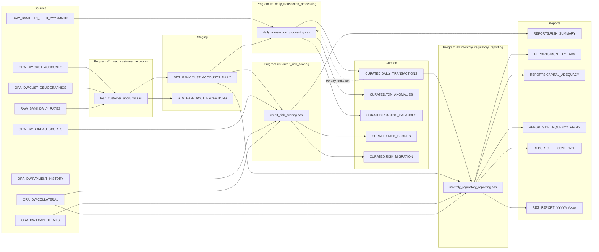

# SAS Banking Migration Assessment

**Migration Target:** dbt on Databricks (Unity Catalog)
**Source System:** SAS 9.4 M7 on Linux (RHEL 7)
**Assessment Date:** 2026-05-20
**Status:** In Progress

---

## 1. Program Inventory

| # | Program | File | Schedule | Complexity |
|---|---------|------|----------|------------|
| 1 | Load Customer Accounts | `Programs/Banking/load_customer_accounts.sas` (216 lines) | Daily 06:00 (BANK_DAILY_01) | Medium |
| 2 | Daily Transaction Processing | `Programs/Banking/daily_transaction_processing.sas` (246 lines) | Daily 07:30 (BANK_DAILY_02) | High |
| 3 | Credit Risk Scoring | `Programs/Banking/credit_risk_scoring.sas` (270 lines) | Weekly Sun 02:00 (BANK_WEEKLY_01) | High |
| 4 | Monthly Regulatory Reporting | `Programs/Banking/monthly_regulatory_reporting.sas` (199 lines) | Monthly 3rd biz day (BANK_MONTHLY_01) | Medium-High |

**Orchestrator:** `BatchJobs/run_daily_banking.sas` (lines 121-131) executes programs 1-4 in dependency order with error handling, control table tracking, and email notifications.

---

## 2. Per-Program Input/Output Tables

### Program #1: load_customer_accounts.sas

| Direction | Library.Table | Description |
|-----------|---------------|-------------|
| Input | `ORA_DW.CUST_ACCOUNTS` | Customer account master from Oracle DW (schema `DW_BANKING`) |
| Input | `ORA_DW.CUST_DEMOGRAPHICS` | Customer demographic data from Oracle DW |
| Input | `RAW_BANK.DAILY_RATES` | Daily interest/exchange rates from flat file |
| Output | `STG_BANK.CUST_ACCOUNTS_DAILY` | Daily customer account snapshot with derived metrics |
| Output | `STG_BANK.ACCT_EXCEPTIONS` | Data quality exception records |

### Program #2: daily_transaction_processing.sas

| Direction | Library.Table | Description |
|-----------|---------------|-------------|
| Input | `RAW_BANK.TXN_FEED_YYYYMMDD` | Daily transaction feed (dynamic date suffix) |
| Input | `STG_BANK.CUST_ACCOUNTS_DAILY` | From Program #1 |
| Input | `BANKING.FORMATS` | Format catalog |
| Input | `CURATED.DAILY_TRANSACTIONS` | Self-reference for 90-day lookback stats |
| Output | `CURATED.DAILY_TRANSACTIONS` | Enriched validated transactions |
| Output | `CURATED.TXN_ANOMALIES` | Flagged anomalous transactions |
| Output | `CURATED.RUNNING_BALANCES` | Per-account running balance snapshots |

### Program #3: credit_risk_scoring.sas

| Direction | Library.Table | Description |
|-----------|---------------|-------------|
| Input | `STG_BANK.CUST_ACCOUNTS_DAILY` | From Program #1 |
| Input | `ORA_DW.BUREAU_SCORES` | Credit bureau FICO/Vantage scores |
| Input | `ORA_DW.PAYMENT_HISTORY` | 12-month payment behavior metrics |
| Input | `ORA_DW.COLLATERAL` | Secured loan collateral valuations |
| Output | `CURATED.RISK_SCORES` | PD/LGD/EAD/Expected Loss per account |
| Output | `CURATED.RISK_MIGRATION` | Rating change tracking (upgrade/downgrade/stable) |
| Output | `REPORTS.RISK_SUMMARY` | Aggregated risk metrics by account type and rating |

### Program #4: monthly_regulatory_reporting.sas

| Direction | Library.Table | Description |
|-----------|---------------|-------------|
| Input | `CURATED.DAILY_TRANSACTIONS` | From Program #2 |
| Input | `STG_BANK.CUST_ACCOUNTS_DAILY` | From Program #1 |
| Input | `ORA_DW.LOAN_DETAILS` | Loan-level detail (DPD, allowance, LTV) |
| Input | `ORA_DW.COLLATERAL` | Collateral valuations |
| Output | `REPORTS.MONTHLY_RWA` | Risk-Weighted Assets by category |
| Output | `REPORTS.CAPITAL_ADEQUACY` | CET1/Tier1/Total capital ratios |
| Output | `REPORTS.DELINQUENCY_AGING` | 30/60/90/120/180+ delinquency buckets |
| Output | `REPORTS.LLP_COVERAGE` | Loan loss provision coverage ratios |
| Output | `/data/sas/reports/output/REG_REPORT_YYYYMM.xlsx` | Excel export (3 sheets) |

---

## 3. Macro Dependency Map

| Macro | Purpose | Used By |
|-------|---------|---------|
| `parmv.sas` | Parameter validation utility | All 4 programs |
| `nobs.sas` | Return observation count for a dataset | All 4 programs |
| `lock.sas` | Obtain/release dataset locks for concurrent access | Programs #1, #2, #3 |
| `export_xlsx.sas` | Export SAS dataset to Excel worksheet | Program #4 |
| `sendmail.sas` | Email notification utility | Program #1 (conditional), Orchestrator |

---

## 4. SAS Construct Matrix

| SAS Construct | Program(s) | Migration Strategy |
|---------------|-----------|-------------------|
| `DATA step` with derived columns | #1 (lines 82-157) | SQL CASE expressions + CTEs |
| `PROC SQL` joins | #1, #2, #3, #4 | Direct SQL translation |
| `RETAIN` / `BY` running balance | #2 (lines 137-154) | `SUM() OVER (PARTITION BY ... ORDER BY ... ROWS UNBOUNDED PRECEDING)` |
| `%GOTO` / conditional flow | #1 (line 76), #2 (line 39) | dbt `{{ config() }}` + model-level control |
| `PROC APPEND` with `%lock` | #2 (lines 205-216), #3 (lines 229-241) | `{{ config(materialized='incremental') }}` |
| Correlated subquery (max date) | #3 (lines 76-78) | `ROW_NUMBER() OVER (PARTITION BY ... ORDER BY ... DESC)` |
| `calculated` keyword | #4 (line 59) | Inline expression or CTE reference |
| WOE scorecard model | #3 (lines 92-197) | SQL CASE expressions + seed file for coefficients |
| Multi-output DATA step | #1 (lines 82-157) | Separate dbt models per output |
| `PROC MEANS` aggregation | #1 (lines 188-198), #3 (lines 246-256) | SQL `GROUP BY` aggregation |
| Dynamic dataset name (`TXN_FEED_YYYYMMDD`) | #2 (line 25) | Parameterized source or incremental ingestion |
| `PROC FORMAT` lookups | #1 (lines 87-95) | dbt seed CSV files + `{{ ref() }}` joins |
| `%sendmail` alerts | #1 (line 175), orchestrator | dbt post-hook or external alerting |
| `%export_xlsx` | #4 (lines 146-162) | Databricks notebook or Python post-processing |
| `fmtsearch=(BANKING ...)` | `Config/autoexec.sas` (line 22) | Seed files replace format catalogs |

---

## 5. Complexity Ranking

| Rank | Program | Complexity | Rationale |
|------|---------|-----------|-----------|
| 1 | credit_risk_scoring.sas | **High** | WOE scorecard model with 5 feature bins, logistic regression, PD/LGD/EAD calculations, correlated subqueries, risk migration matrix |
| 2 | daily_transaction_processing.sas | **High** | RETAIN/BY running balance, 90-day rolling anomaly detection with Z-scores, self-referencing dataset, dynamic dataset naming, multi-step validation pipeline |
| 3 | monthly_regulatory_reporting.sas | **Medium-High** | Basel III risk-weight mapping, `calculated` keyword, delinquency aging buckets, capital adequacy ratios, Excel multi-sheet export |
| 4 | load_customer_accounts.sas | **Medium** | Foundation ETL with PROC SQL joins, derived metrics, multi-output DATA step for exceptions, format assignments |

---

## 6. Key Migration Risk Factors

| Risk Factor | Severity | Mitigation |
|-------------|----------|------------|
| RETAIN/BY stateful logic | High | Validate window function output against SAS running balances row-by-row |
| WOE model coefficient fidelity | High | Externalize coefficients to seed file; compare PD distributions |
| Self-referencing dataset (90-day lookback) | Medium | Incremental materialization with proper `is_incremental()` logic |
| Dynamic dataset naming (`TXN_FEED_YYYYMMDD`) | Medium | Parameterized source or wildcard ingestion pattern |
| `calculated` keyword semantics | Low | Use CTEs or inline expressions in Databricks SQL |
| Oracle-specific SQL (SAS pass-through) | Medium | Translate Oracle functions to Databricks/Spark SQL equivalents |
| Excel export (`%export_xlsx`) | Low | Defer to downstream Python/notebook; dbt produces the tables |
| Email alerting (`%sendmail`) | Low | Replace with dbt post-hooks or external orchestration |
| Format catalog dependencies | Low | Replace with seed CSV joins |
| Concurrent dataset locking (`%lock`) | Low | dbt handles concurrency natively |

---

## 7. Data Lineage Diagram

---

## 8. Recommended Migration Order

| Wave | Program(s) | Rationale |
|------|-----------|-----------|
| **Wave 1** | #1 load_customer_accounts (+ seeds, sources, macros) | Foundation — all other programs depend on `STG_BANK.CUST_ACCOUNTS_DAILY` |
| **Wave 2** | #2 daily_transaction_processing, #3 credit_risk_scoring (parallel) | Both consume `stg_cust_accounts_daily` but are independent of each other |
| **Wave 3** | #4 monthly_regulatory_reporting (+ integration tests, CI/CD) | Depends on outputs from both #1 and #2 |

---

## 9. dbt Architecture Mapping

| SAS Layer | SAS Library | dbt Layer | Materialization |
|-----------|------------|-----------|-----------------|
| Raw / Landing | `RAW_BANK`, `ORA_DW` | `source()` | External (Unity Catalog) |
| Staging | `STG_BANK` | `models/staging/` | `view` |
| Curated | `CURATED` | `models/curated/` | `table` or `incremental` |
| Reports | `REPORTS` | `models/reports/` | `table` |
| Formats | `BANKING.FORMATS` | `seeds/` | `seed` (CSV) |
| Macros | `Macro/*.sas` | `macros/` | Jinja macros |
