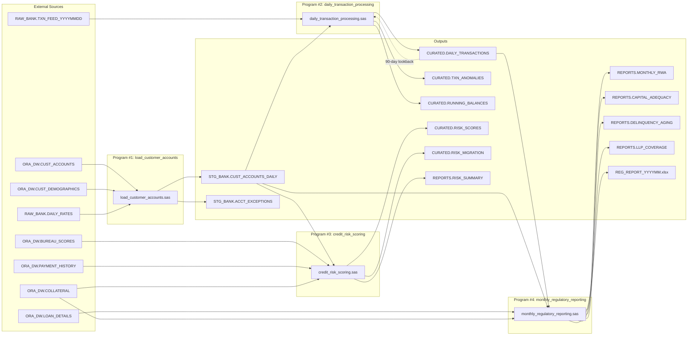

# SAS Banking Migration Assessment

> **Scope**: Banking domain programs within the SAS legacy analytics estate  
> **Target Platform**: dbt + Databricks (Unity Catalog)  
> **Date**: 2024-01

---

## 1. Program Inventory

| # | Program | File Path | Schedule | Orchestrator Step |
|---|---------|-----------|----------|-------------------|
| 1 | Load Customer Accounts | `Programs/Banking/load_customer_accounts.sas` | Daily 06:00 (BANK_DAILY_01) | `BatchJobs/run_daily_banking.sas` Step 1 (line 121) |
| 2 | Daily Transaction Processing | `Programs/Banking/daily_transaction_processing.sas` | Daily 07:30 (BANK_DAILY_02) | `BatchJobs/run_daily_banking.sas` Step 2 (line 124) |
| 3 | Credit Risk Scoring | `Programs/Banking/credit_risk_scoring.sas` | Weekly Sun 02:00 (BANK_WEEKLY_01) | `BatchJobs/run_daily_banking.sas` Step 3 (line 127) |
| 4 | Monthly Regulatory Reporting | `Programs/Banking/monthly_regulatory_reporting.sas` | Monthly 3rd biz day (BANK_MONTHLY_01) | `BatchJobs/run_daily_banking.sas` Step 4 (line 130) |

All four programs are executed sequentially via the master orchestrator `BatchJobs/run_daily_banking.sas` (steps 1–4, lines 121–131), scheduled daily at 05:45 via Control-M job `BANK_MASTER`.

---

## 2. Data Sources (Inputs)

### 2.1 load_customer_accounts.sas

| Source | Library.Table | Description |
|--------|--------------|-------------|
| Oracle DW | `ORA_DW.CUST_ACCOUNTS` | Customer account master (balances, limits, status) |
| Oracle DW | `ORA_DW.CUST_DEMOGRAPHICS` | Customer demographic attributes (segment, region, DOB) |
| File Feed | `RAW_BANK.DAILY_RATES` | Daily interest rate reference data |

### 2.2 daily_transaction_processing.sas

| Source | Library.Table | Description |
|--------|--------------|-------------|
| File Feed | `RAW_BANK.TXN_FEED_YYYYMMDD` | Daily transaction flat file (dynamic dataset name) |
| Staging | `STG_BANK.CUST_ACCOUNTS_DAILY` | Output of Program #1 (dependency) |
| Curated | `CURATED.DAILY_TRANSACTIONS` | 90-day lookback for anomaly detection Z-score stats |
| Format Catalog | `BANKING` | Format catalog via `fmtsearch=(BANKING ...)` |

### 2.3 credit_risk_scoring.sas

| Source | Library.Table | Description |
|--------|--------------|-------------|
| Staging | `STG_BANK.CUST_ACCOUNTS_DAILY` | Output of Program #1 (dependency) |
| Oracle DW | `ORA_DW.BUREAU_SCORES` | External credit bureau FICO/Vantage scores |
| Oracle DW | `ORA_DW.PAYMENT_HISTORY` | Payment behavior over 12 months |
| Oracle DW | `ORA_DW.COLLATERAL` | Secured loan collateral values |

### 2.4 monthly_regulatory_reporting.sas

| Source | Library.Table | Description |
|--------|--------------|-------------|
| Curated | `CURATED.DAILY_TRANSACTIONS` | Transaction history for period |
| Staging | `STG_BANK.CUST_ACCOUNTS_DAILY` | Account snapshot at month-end |
| Oracle DW | `ORA_DW.LOAN_DETAILS` | Loan attributes (DPD, allowance, LTV) |
| Oracle DW | `ORA_DW.COLLATERAL` | Collateral values for RWA calculation |

### 2.5 Consolidated External Source Map

| External System | Connection | Config Reference |
|-----------------|-----------|-----------------|
| Oracle DW (`FINPROD`) | SAS/ACCESS Oracle, schema `DW_BANKING` | `Config/autoexec.sas` lines 62–70 |
| RAW_BANK file feeds | SAS library at `/data/sas/raw/banking` | `Config/autoexec.sas` line 35 |
| Format catalogs | `/data/sas/formats/banking` | `Config/autoexec.sas` line 55, `fmtsearch` line 22 |

---

## 3. Outputs Produced

| # | Program | Output | Library | Type |
|---|---------|--------|---------|------|
| 1 | load_customer_accounts | `CUST_ACCOUNTS_DAILY` | STG_BANK | Dataset (table) |
| 2 | load_customer_accounts | `ACCT_EXCEPTIONS` | STG_BANK | Dataset (table) |
| 3 | daily_transaction_processing | `DAILY_TRANSACTIONS` | CURATED | Dataset (append) |
| 4 | daily_transaction_processing | `TXN_ANOMALIES` | CURATED | Dataset (append) |
| 5 | daily_transaction_processing | `RUNNING_BALANCES` | CURATED | Dataset (replace) |
| 6 | credit_risk_scoring | `RISK_SCORES` | CURATED | Dataset (append) |
| 7 | credit_risk_scoring | `RISK_MIGRATION` | CURATED | Dataset (append) |
| 8 | credit_risk_scoring | `RISK_SUMMARY` | REPORTS | Dataset (replace) |
| 9 | monthly_regulatory_reporting | `MONTHLY_RWA` | REPORTS | Dataset (replace) |
| 10 | monthly_regulatory_reporting | `CAPITAL_ADEQUACY` | REPORTS | Dataset (replace) |
| 11 | monthly_regulatory_reporting | `DELINQUENCY_AGING` | REPORTS | Dataset (replace) |
| 12 | monthly_regulatory_reporting | `LLP_COVERAGE` | REPORTS | Dataset (replace) |
| 13 | monthly_regulatory_reporting | `REG_REPORT_YYYYMM.xlsx` | File system | Excel workbook (3 sheets) |

---

## 4. Macro Dependencies

### 4.1 Per-Program %include Macros

| Program | %include Macros |
|---------|----------------|
| load_customer_accounts.sas | `parmv.sas`, `nobs.sas`, `lock.sas` |
| daily_transaction_processing.sas | `parmv.sas`, `nobs.sas`, `lock.sas` |
| credit_risk_scoring.sas | `parmv.sas`, `nobs.sas` |
| monthly_regulatory_reporting.sas | `parmv.sas`, `nobs.sas`, `export_xlsx.sas` |

### 4.2 Runtime Macros Called

| Macro | Purpose | Used By |
|-------|---------|---------|
| `%parmv()` | Parameter validation | All programs |
| `%nobs()` | Get observation count for a dataset | All programs |
| `%lock()` / `%lock(, unlock)` | Acquire/release dataset lock for concurrent append | Programs #2, #3 |
| `%export_xlsx()` | Export dataset to Excel worksheet | Program #4 |
| `%sendmail()` | Send email notification | Programs #1 (conditional), orchestrator |

### 4.3 Global Macro Variables (from `Config/autoexec.sas` lines 84–100)

| Variable | Value / Purpose | Line |
|----------|----------------|------|
| `&CURR_DT` | Current date (`%sysfunc(today(), date9.)`) | 89 |
| `&CURR_YM` | Current year-month (`yymmn6.`) | 90 |
| `&PREV_YM` | Previous month (`yymmn6.`) | 91 |
| `&FY_START` | Fiscal year start date | 92 |
| `&REPORT_PATH` | `/data/sas/reports/output` | 87 |
| `&EMAIL_DL` | `sas-ops@corp.internal` | 95 |
| `&EMAIL_ONCALL` | `oncall-data@corp.internal` | 96 |
| `&MAX_OBS_WARN` | 10,000,000 | 99 |
| `&ABORT_ON_ERR` | `Y` | 100 |
| `&ENVIRONMENT` | `PROD` | 84 |
| `&BASE_PATH` | `/data/sas` | 85 |
| `&LOG_PATH` | `/data/sas/logs` | 86 |

### 4.4 Format Catalog Dependencies

All banking programs depend on the `BANKING` format catalog resolved via `fmtsearch=(BANKING ...)` (`Config/autoexec.sas` line 22). The catalog is built by `Formats/banking_formats.sas` and contains:

| Format | Type | Used By |
|--------|------|---------|
| `$ACCTTYPE.` | Character | Programs #1, #2, #3, #4 |
| `$ACCTSTAT.` | Character | Program #1 |
| `RISKRATE.` | Numeric | Programs #1, #3 |
| `$CUSTSEG.` | Character | Programs #1, #2 |
| `$REGION.` | Character | Programs #1, #2, #4 |
| `$TXNCAT.` | Character | Program #2 |
| `DELQBKT.` | Numeric | Program #4 |
| `BALRANGE.` | Numeric | Reporting |

---

## 5. SAS Constructs Used

| Construct | Category | Programs | Migration Pattern |
|-----------|----------|----------|-------------------|
| DATA step with multi-output (`output DS1; output DS2;`) | Data Processing | #1, #2 | CASE/WHEN routing or separate models |
| PROC SQL `CREATE TABLE AS SELECT` | SQL | All | Direct SQL translation |
| PROC SQL correlated subquery | SQL (advanced) | #3 (bureau score date) | `ROW_NUMBER() OVER (PARTITION BY ... ORDER BY ...)` |
| PROC SQL `calculated` keyword | SAS-specific SQL | #3, #4 | CTE or column alias reference |
| RETAIN / BY-group processing | Stateful iteration | #2 (running balance) | Window functions (`SUM() OVER (ORDER BY ...)`) |
| `%GOTO` / `%RETURN` | Flow control | #1 (`%goto EXIT`), #2 (`%goto ABORT`) | dbt `{{ exceptions.raise_compiler_error() }}` or model pre-conditions |
| `%lock()` / `PROC APPEND` | Concurrent write | #2, #3 | Delta `MERGE INTO` / incremental model |
| `PROC MEANS ... OUTPUT OUT=` | Aggregation | #1, #3 | `GROUP BY` with aggregate functions |
| `%export_xlsx()` | Excel generation | #4 | Python/notebook or dbt post-hook |
| WOE binning + logistic scoring | Model execution | #3 | `CASE WHEN` bins + arithmetic in SQL |
| Dynamic dataset names (`&txn_ds`) | Macro-driven | #2 | dbt `{{ var() }}` or source with dynamic schema |
| `PROC FORMAT` value labels | Lookup encoding | All (via format catalog) | Seed tables with JOIN |
| `format var $FMT.` statement | Display formatting | #1 | Metadata only (or join to lookup) |
| `intck()` / `intnx()` | Date arithmetic | #1, #4 | `DATEDIFF()` / `DATE_ADD()` |

---

## 6. Complexity Ranking

| Rank | Program | Complexity | Key Drivers |
|------|---------|-----------|-------------|
| #1 (Highest) | `credit_risk_scoring.sas` | **High** | WOE scorecard with embedded coefficients, correlated subquery for latest bureau score, PD/LGD/EAD calculation, risk migration matrix, multiple `%lock`/`PROC APPEND` targets |
| #2 | `daily_transaction_processing.sas` | **High** | RETAIN/BY running balance (stateful), Z-score anomaly detection against 90-day lookback, dynamic dataset names, `%lock`/`PROC APPEND`, validation/reject routing |
| #3 | `monthly_regulatory_reporting.sas` | **Medium-High** | Basel III RWA with risk-weight logic, capital adequacy ratios, 5 output datasets + Excel workbook, `calculated` keyword, LTV-conditional weights |
| #4 (Lowest) | `load_customer_accounts.sas` | **Medium** | Straightforward ETL (extract → transform → load), multi-output DATA step for exceptions, derived metrics (utilization, dormancy), format application — but no complex stateful logic |

---

## 7. Key Migration Risk Factors

| Risk Factor | SAS Construct | Affected Program(s) | Migration Strategy |
|-------------|---------------|---------------------|-------------------|
| RETAIN/BY running balance | `retain RUNNING_BALANCE; if first.ACCOUNT_ID then ...` | #2 | `SUM(...) OVER (PARTITION BY account_id ORDER BY txn_date, txn_id ROWS UNBOUNDED PRECEDING)` |
| Embedded scorecard coefficients | Hard-coded WOE bins + logistic weights | #3 | dbt seed or config YAML for model coefficients; SQL CASE bins |
| `%lock` / `PROC APPEND` | Concurrent dataset locking + incremental append | #2, #3 | Delta `MERGE INTO` / dbt incremental model with `unique_key` |
| Correlated subquery (latest score) | `select max(SCORE_DATE) from ... where CUSTOMER_ID = b.CUSTOMER_ID` | #3 | `ROW_NUMBER() OVER (PARTITION BY customer_id ORDER BY score_date DESC) = 1` |
| Dynamic dataset names | `%let txn_ds = TXN_FEED_%sysfunc(...)` | #2 | dbt source with `identifier` Jinja or `{{ var('txn_date') }}` |
| PROC FORMAT → display labels | `format ACCOUNT_TYPE $ACCTTYPE.` | All | Seed tables with LEFT JOIN for descriptive labels |
| `%GOTO` error handling | `%goto EXIT` / `%goto ABORT` | #1, #2 | dbt model pre-conditions, `{{ exceptions.raise_compiler_error() }}`, or `dbt test` as gate |
| Excel export | `%export_xlsx()` with multi-sheet | #4 | Python script, dbt post-hook, or notebook export step |
| 90-day lookback self-reference | Query `CURATED.DAILY_TRANSACTIONS` (own output) | #2 | Incremental model with `lookback` window or separate ref |
| `calculated` keyword | Reference computed column in same SELECT | #3, #4 | CTE pattern (compute in inner, reference in outer) |

---

## 8. Data Lineage Diagram

---

## 9. Recommended Migration Order

| Order | Program | Rationale |
|-------|---------|-----------|
| 1st | `load_customer_accounts.sas` | **Lowest complexity** + **foundational dependency** — its output `STG_BANK.CUST_ACCOUNTS_DAILY` feeds Programs #2, #3, and #4. Straightforward ETL with SQL-translatable logic. Verification is easy (row counts + column values comparison). |
| 2nd | `daily_transaction_processing.sas` | Next in dependency chain. RETAIN/BY logic maps cleanly to window functions. Depends only on Program #1's output + external feeds. |
| 3rd | `credit_risk_scoring.sas` | Highest complexity but isolated — depends only on Program #1's output + Oracle DW sources. Scorecard coefficients can be externalized to seed/config. |
| 4th | `monthly_regulatory_reporting.sas` | Depends on outputs from Programs #1 and #2. Multiple outputs + Excel export require post-migration tooling. Migrate last once upstream models are validated. |

### Verification Strategy

For each migrated program:
1. **Row count parity** — Compare SAS output table observation count vs. dbt model row count
2. **Column-level comparison** — Sample 1,000 records and compare key metrics (balances, ratios, scores)
3. **Aggregate reconciliation** — Compare SUM/AVG/COUNT of numeric columns between SAS and dbt outputs
4. **Exception/edge-case validation** — Verify boundary conditions (NULL handling, zero-division guards, date edge cases)
